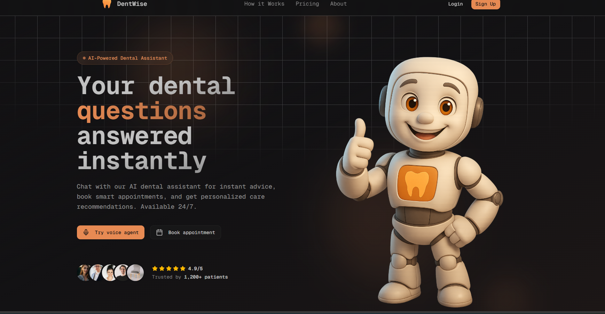
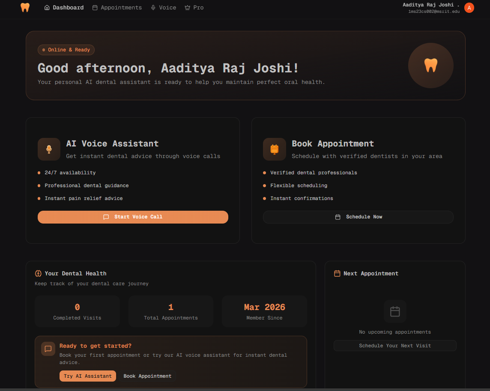

# 🦷 DentWise – AI-Powered Dental Management System

DentWise is a full-stack AI-powered dental management platform that helps clinics manage appointments, automate workflows, and improve patient experience.

---

## 🌐 Live Demo

🔗 https://your-live-link.com

---

## 💡 Problem Statement

Managing dental clinics manually leads to inefficiencies in scheduling, patient communication, and billing.

DentWise solves this by providing an automated, scalable, and intelligent system for modern clinics.

---

## 🚀 Features

* 🧑‍⚕️ Patient & Admin Authentication
* 📅 Multi-step Appointment Booking
* 🤖 AI Voice Agent
* 📧 Email Notifications
* 💳 Payment Integration
* 📊 Admin Dashboard
* 🧾 Invoice System
* 🔐 Secure Role-Based Access

---

## 📸 Screenshots

### 🏠 Landing Page

<p align="center">
  
  
  
  
  
  
</p>

---

### 🧑‍💼 Admin Page

<p align="center">
  
</p>

---

### 📊 Dashboard

<p align="center">
  
  
</p>

---

### 💳 Pro Page

<p align="center">
  
</p>

---

### 🎙️ Voice Page

<p align="center">
  
</p>

---

## 🛠️ Tech Stack

**Frontend**

* React.js
* Tailwind CSS

**Backend**

* Node.js
* Express.js

**Database**

* PostgreSQL
* Prisma ORM


**Services**

* Clerk (Authentication)
* Stripe (Payments)
* Email Service

**State Management and Data Fetching**

* TanStack React Query

**Form Handling & Validation**

* React Hook Form
* Zod

**AI Integration**

* Vapi AI

---

## 🧠 Architecture

* REST API backend
* Component-based frontend
* Secure authentication
* Scalable database

---

## ⚙️ Installation

```bash
git clone https://github.com/your-username/dentwise.git
cd dentwise
npm install
npm run dev
```

---

## 📂 Project Structure

```
dentwise/
│── client/
│── server/
│── screenshots/
│── components/
│── routes/
```

---

## 🎯 Key Learnings

* Built real-world SaaS system
* Integrated auth + payments
* Designed scalable backend
* Improved UI/UX

---

## 🔮 Future Improvements

* 📱 Mobile optimization
* 🧠 Advanced AI features
* 📊 Analytics dashboard

---

## 👨‍💻 Author

Aaditya Raj Joshi

---

## ⭐ Support

If you like this project, give it a ⭐ on GitHub!
